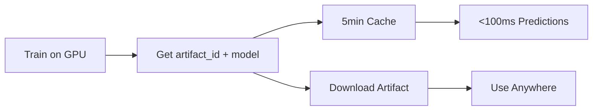

# ⚡ WarpGBM MCP Service

> **GPU-accelerated gradient boosting as a cloud MCP service**  
> Train on A10G GPUs • Get `artifact_id` for <100ms cached predictions • Download portable artifacts

<div align="center">

[](https://smithery.ai/server/@jefferythewind/warpgbm-mcp)
[](https://www.gnu.org/licenses/gpl-3.0)
[](https://warpgbm.ai)
[](https://modelcontextprotocol.io)
[](https://x402.org)

[🌐 Live Service](https://warpgbm.ai) • [📖 API Docs](https://warpgbm.ai/docs) • [🤖 Agent Guide](https://warpgbm.ai/guide) • [🐍 Python Package](https://github.com/jefferythewind/warpgbm)

</div>

---

## 🎯 What is This?

**Outsource your GBDT workload to the world's fastest GPU implementation.**

WarpGBM MCP is a **stateless cloud service** that gives AI agents instant access to GPU-accelerated gradient boosting. Built on [WarpGBM](https://github.com/jefferythewind/warpgbm) (91+ ⭐), this service handles training on NVIDIA A10G GPUs while you receive portable model artifacts and benefit from smart 5-minute caching.

### 🏗️ How It Works (The Smart Cache Workflow)



1. **Train**: POST your data → Train on A10G GPU → Get `artifact_id` + portable artifact
2. **Fast Path**: Use `artifact_id` → Sub-100ms cached predictions (5min TTL)
3. **Slow Path**: Use `model_artifact_joblib` → Download and use anywhere

**Architecture**: 🔒 Stateless • 🚀 No model storage • 💾 You own your artifacts

---

## ⚡ Quick Start

### For AI Agents (MCP)

Add to your MCP settings (e.g., `.cursor/mcp.json`):

```json
{
  "mcpServers": {
    "warpgbm": {
      "url": "https://warpgbm.ai/mcp/sse"
    }
  }
}
```

### For Developers (REST API)

```bash
# 1. Train a model
curl -X POST https://warpgbm.ai/train \
  -H "Content-Type: application/json" \
  -d '{
    "X": [[5.1,3.5,1.4,0.2], [6.7,3.1,4.4,1.4], ...],
    "y": [0, 1, 2, ...],
    "model_type": "warpgbm",
    "objective": "multiclass"
  }'

# Response includes artifact_id for fast predictions
# {"artifact_id": "abc-123", "model_artifact_joblib": "H4sIA..."}

# 2. Make fast predictions (cached, <100ms)
curl -X POST https://warpgbm.ai/predict_from_artifact \
  -H "Content-Type: application/json" \
  -d '{
    "artifact_id": "abc-123",
    "X": [[5.0,3.4,1.5,0.2]]
  }'
```

---

## 🚀 Key Features

| Feature | Description |
|---------|-------------|
| 🎯 **Multi-Model** | WarpGBM (GPU) + LightGBM (CPU) |
| ⚡ **Smart Caching** | `artifact_id` → 5min cache → <100ms inference |
| 📦 **Portable Artifacts** | Download joblib models, use anywhere |
| 🤖 **MCP Native** | Direct tool integration for AI agents |
| 💰 **X402 Payments** | Optional micropayments (Base network) |
| 🔒 **Stateless** | No data storage, you own your models |
| 🌐 **Production Ready** | Deployed on Modal with custom domain |

---

## 🐍 Python Package vs MCP Service

**This repo is the MCP service wrapper.** For production ML workflows, consider using the [WarpGBM Python package](https://github.com/jefferythewind/warpgbm) directly:

| Feature | MCP Service (This Repo) | [Python Package](https://github.com/jefferythewind/warpgbm) |
|---------|------------------------|----------------|
| **Installation** | None needed | `pip install git+https://...` |
| **GPU** | Cloud (pay-per-use) | Your GPU (free) |
| **Control** | REST API parameters | Full Python API |
| **Features** | Train, predict, upload | + Cross-validation, callbacks, feature importance |
| **Best For** | Quick experiments, demos | Production pipelines, research |
| **Cost** | $0.01 per training | Free (your hardware) |

**Use this MCP service for**: Quick tests, prototyping, agents without local GPU  
**Use Python package for**: Production ML, research, cost savings, full control

---

## 📡 Available Endpoints

### Core Endpoints

| Method | Endpoint | Description |
|--------|----------|-------------|
| `GET` | `/models` | List available model backends |
| `POST` | `/train` | Train model, get artifact_id + model |
| `POST` | `/predict_from_artifact` | Fast predictions (artifact_id or model) |
| `POST` | `/predict_proba_from_artifact` | Probability predictions |
| `POST` | `/upload_data` | Upload CSV/Parquet for training |
| `POST` | `/feedback` | Submit feedback to improve service |
| `GET` | `/healthz` | Health check with GPU status |

### MCP Integration

| Method | Endpoint | Description |
|--------|----------|-------------|
| `SSE` | `/mcp/sse` | MCP Server-Sent Events endpoint |
| `GET` | `/.well-known/mcp.json` | MCP capability manifest |
| `GET` | `/.well-known/x402` | X402 pricing manifest |

---

## 💡 Complete Example: Iris Dataset

```bash
# 1. Train WarpGBM on Iris (60 samples recommended for proper binning)
curl -X POST https://warpgbm.ai/train \
  -H "Content-Type: application/json" \
  -d '{
  "X": [[5.1,3.5,1.4,0.2], [4.9,3,1.4,0.2], [4.7,3.2,1.3,0.2], [4.6,3.1,1.5,0.2], [5,3.6,1.4,0.2],
        [7,3.2,4.7,1.4], [6.4,3.2,4.5,1.5], [6.9,3.1,4.9,1.5], [5.5,2.3,4,1.3], [6.5,2.8,4.6,1.5],
        [6.3,3.3,6,2.5], [5.8,2.7,5.1,1.9], [7.1,3,5.9,2.1], [6.3,2.9,5.6,1.8], [6.5,3,5.8,2.2],
        [7.6,3,6.6,2.1], [4.9,2.5,4.5,1.7], [7.3,2.9,6.3,1.8], [6.7,2.5,5.8,1.8], [7.2,3.6,6.1,2.5],
        [5.1,3.5,1.4,0.2], [4.9,3,1.4,0.2], [4.7,3.2,1.3,0.2], [4.6,3.1,1.5,0.2], [5,3.6,1.4,0.2],
        [7,3.2,4.7,1.4], [6.4,3.2,4.5,1.5], [6.9,3.1,4.9,1.5], [5.5,2.3,4,1.3], [6.5,2.8,4.6,1.5],
        [6.3,3.3,6,2.5], [5.8,2.7,5.1,1.9], [7.1,3,5.9,2.1], [6.3,2.9,5.6,1.8], [6.5,3,5.8,2.2],
        [7.6,3,6.6,2.1], [4.9,2.5,4.5,1.7], [7.3,2.9,6.3,1.8], [6.7,2.5,5.8,1.8], [7.2,3.6,6.1,2.5],
        [5.1,3.5,1.4,0.2], [4.9,3,1.4,0.2], [4.7,3.2,1.3,0.2], [4.6,3.1,1.5,0.2], [5,3.6,1.4,0.2],
        [7,3.2,4.7,1.4], [6.4,3.2,4.5,1.5], [6.9,3.1,4.9,1.5], [5.5,2.3,4,1.3], [6.5,2.8,4.6,1.5],
        [6.3,3.3,6,2.5], [5.8,2.7,5.1,1.9], [7.1,3,5.9,2.1], [6.3,2.9,5.6,1.8], [6.5,3,5.8,2.2],
        [7.6,3,6.6,2.1], [4.9,2.5,4.5,1.7], [7.3,2.9,6.3,1.8], [6.7,2.5,5.8,1.8], [7.2,3.6,6.1,2.5]],
  "y": [0,0,0,0,0, 1,1,1,1,1, 2,2,2,2,2,2,2,2,2,2,
        0,0,0,0,0, 1,1,1,1,1, 2,2,2,2,2,2,2,2,2,2,
        0,0,0,0,0, 1,1,1,1,1, 2,2,2,2,2,2,2,2,2,2],
  "model_type": "warpgbm",
  "objective": "multiclass",
  "n_estimators": 100
}'

# Response:
{
  "artifact_id": "abc123-def456-ghi789",
  "model_artifact_joblib": "H4sIA...",
  "training_time_seconds": 0.0
}

# 2. Fast inference with cached artifact_id (<100ms)
curl -X POST https://warpgbm.ai/predict_from_artifact \
  -H "Content-Type: application/json" \
  -d '{
  "artifact_id": "abc123-def456-ghi789",
  "X": [[5,3.4,1.5,0.2], [6.7,3.1,4.4,1.4], [7.7,3.8,6.7,2.2]]
}'

# Response: {"predictions": [0, 1, 2], "inference_time_seconds": 0.05}
# Perfect classification! ✨
```

> **⚠️ Important**: WarpGBM uses quantile binning which requires **60+ samples** for proper training. With fewer samples, the model can't learn proper decision boundaries.

---

## 🏠 Self-Hosting

### Local Development

```bash
# Clone repo
git clone https://github.com/jefferythewind/mcp-warpgbm.git
cd mcp-warpgbm

# Setup environment
python3 -m venv .venv
source .venv/bin/activate
pip install -r requirements.txt

# Run locally (GPU optional for dev)
uvicorn local_dev:app --host 0.0.0.0 --port 8000 --reload

# Test
curl http://localhost:8000/healthz
```

### Deploy to Modal (Production)

```bash
# Install Modal
pip install modal

# Authenticate
modal token new

# Deploy
modal deploy modal_app.py

# Service will be live at your Modal URL
```

### Deploy to Other Platforms

```bash
# Docker (requires GPU)
docker build -t warpgbm-mcp .
docker run --gpus all -p 8000:8000 warpgbm-mcp

# Fly.io, Railway, Render, etc.
# See their respective GPU deployment docs
```

---

## 🧪 Testing

```bash
# Install dev dependencies
pip install -r requirements-dev.txt

# Run all tests
./run_tests.sh

# Or use pytest directly
pytest tests/ -v

# Test specific functionality
pytest tests/test_train.py -v
pytest tests/test_integration.py -v
```

---

## 📦 Project Structure

```
mcp-warpgmb/
├── app/
│   ├── main.py              # FastAPI app + routes
│   ├── mcp_sse.py           # MCP Server-Sent Events
│   ├── model_registry.py    # Model backend registry
│   ├── models.py            # Pydantic schemas
│   ├── utils.py             # Serialization, caching
│   ├── x402.py              # Payment verification
│   └── feedback_storage.py  # Feedback persistence
├── .well-known/
│   ├── mcp.json             # MCP capability manifest
│   └── x402                 # X402 pricing manifest
├── docs/
│   ├── AGENT_GUIDE.md       # Comprehensive agent docs
│   ├── MODEL_SUPPORT.md     # Model parameter reference
│   └── WARPGBM_PYTHON_GUIDE.md
├── tests/
│   ├── test_train.py
│   ├── test_predict.py
│   ├── test_integration.py
│   └── conftest.py
├── examples/
│   ├── simple_train.py
│   └── compare_models.py
├── modal_app.py             # Modal deployment config
├── local_dev.py             # Local dev server
├── requirements.txt
└── README.md
```

---

## 💰 Pricing (X402)

Optional micropayments on Base network:

| Endpoint | Price | Description |
|----------|-------|-------------|
| `/train` | $0.01 | Train model on GPU, get artifacts |
| `/predict_from_artifact` | $0.001 | Batch predictions |
| `/predict_proba_from_artifact` | $0.001 | Probability predictions |
| `/feedback` | Free | Help us improve! |

> **Note**: Payment is optional for demo/testing. See `/.well-known/x402` for details.

---

## 🔐 Security & Privacy

✅ **Stateless**: No training data or models persisted  
✅ **Sandboxed**: Runs in temporary isolated directories  
✅ **Size Limited**: Max 50 MB request payload  
✅ **No Code Execution**: Only structured JSON parameters  
✅ **Rate Limited**: Per-IP throttling to prevent abuse  
✅ **Read-Only FS**: Modal deployment uses immutable filesystem  

---

## 🌍 Available Models

### 🚀 WarpGBM (GPU)
- **Acceleration**: NVIDIA A10G GPUs
- **Speed**: 13× faster than LightGBM
- **Best For**: Time-series, financial modeling, temporal data
- **Special**: Era-aware splitting, invariant learning
- **Min Samples**: 60+ recommended

### ⚡ LightGBM (CPU)
- **Acceleration**: Highly optimized CPU
- **Speed**: 10-100× faster than sklearn
- **Best For**: General tabular data, large datasets
- **Special**: Categorical features, low memory
- **Min Samples**: 20+

---

## 🗺️ Roadmap

- [x] Core training + inference endpoints
- [x] Smart artifact caching (5min TTL)
- [x] MCP Server-Sent Events integration
- [x] X402 payment verification
- [x] Modal deployment with GPU
- [x] Custom domain (warpgbm.ai)
- [x] Smithery marketplace listing
- [ ] ONNX export support
- [ ] Async job queue for large datasets
- [ ] S3/IPFS dataset URL support
- [ ] Python client library (`warpgbm-client`)
- [ ] Additional model backends (XGBoost, CatBoost)

---

## 💬 Feedback & Support

**Help us make this service better for AI agents!**

Submit feedback about:
- Missing features that would unlock new use cases
- Confusing documentation or error messages
- Performance issues or timeout problems
- Additional model types you'd like to see

```bash
# Via API
curl -X POST https://warpgbm.ai/feedback \
  -H "Content-Type: application/json" \
  -d '{
    "feedback_type": "feature_request",
    "message": "Add support for XGBoost backend",
    "severity": "medium"
  }'
```

Or via:
- **GitHub Issues**: [mcp-warpgbm/issues](https://github.com/jefferythewind/mcp-warpgbm/issues)
- **GitHub Discussions**: [warpgbm/discussions](https://github.com/jefferythewind/warpgbm/discussions)
- **Email**: support@warpgbm.ai

---

## 📚 Learn More

- 🐍 **[WarpGBM Python Package](https://github.com/jefferythewind/warpgbm)** - The core library (91+ ⭐)
- 🤖 **[Agent Guide](https://warpgbm.ai/guide)** - Complete usage guide for AI agents
- 📖 **[API Docs](https://warpgbm.ai/docs)** - Interactive OpenAPI documentation
- 🔌 **[Model Context Protocol](https://modelcontextprotocol.io)** - MCP specification
- 💰 **[X402 Specification](https://x402.org)** - Payment protocol for agents
- ☁️ **[Modal Docs](https://modal.com/docs)** - Serverless GPU platform

---

## 📄 License

**GPL-3.0** (same as [WarpGBM core](https://github.com/jefferythewind/warpgbm))

This ensures improvements to the MCP wrapper benefit the community, while allowing commercial use through the cloud service.

---

## 🙏 Credits

Built with:
- [WarpGBM](https://github.com/jefferythewind/warpgbm) - GPU-accelerated GBDT library
- [Modal](https://modal.com) - Serverless GPU infrastructure
- [FastAPI](https://fastapi.tiangolo.com) - Modern Python web framework
- [LightGBM](https://github.com/microsoft/LightGBM) - Microsoft's GBDT library

---

<div align="center">

**Built with ❤️ for the open agent economy**

[⭐ Star on GitHub](https://github.com/jefferythewind/mcp-warpgbm) • [🚀 Try Live Service](https://warpgbm.ai) • [📖 Read the Docs](https://warpgbm.ai/guide)

</div>
